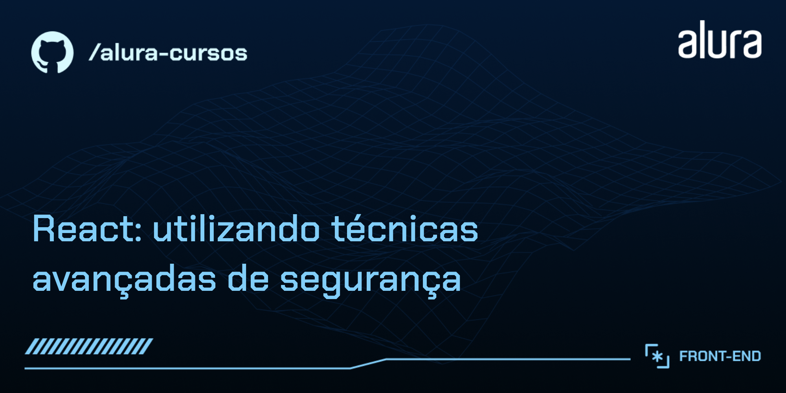

# React: utilizando técnicas avançadas de segurança

O Code Connect é uma aplicação realista de rede social para pessoas desenvolvedoras, com área logada, posts, comentários, likes, perfis e operações sensíveis, servindo como laboratório para aprendermos segurança na prática utilizando React + Next.js.

Ao longo do curso, realizamos auditoria com base em OWASP, corrigimos vulnerabilidades reais e implementamos camadas modernas de mitigação e proteção: XSS, CSRF, RBAC/ABAC, monitoração de dependências e segurança via Security Headers.

---

## 🔨 Funcionalidades da aplicação

A aplicação implementa um fluxo completo de rede social:

- Login, registro e reset de senha
- Listagem de posts
- Página de detalhes
- Comentários
- Likes
- Perfil com bio HTML (superfície de ataque para XSS)

---

## 🛡️ O que aprendemos em segurança

### 🔍 Auditoria de Segurança (OWASP)

- Integração mental com OWASP ASVS, Top10 e WSTG
- Identificação e classificação de superfícies de ataque
- Fluxo real de auditoria (entender → reproduzir → corrigir → validar)

### ⚔️ Proteção contra XSS (Cross-Site Scripting)

- Demonstração de ataque ao vivo
- Sanitização via DOMPurify (server-side)
- Whitelist personalizada
- Markdown seguro
- HTML perigoso
- Defesa em profundidade com CSP

### 🧪 Sanitização, escaping e CSP

- Input validation
- DOMPurify server-side
- CSP com trade-offs documentados
- unsafe-inline analisado tecnicamente
- Headers adicionais contra XSS

> Segurança é por camadas — sanitização, validação, headers, CSP e design seguro.

### 🔐 Proteção contra CSRF (Cross-Site Request Forgery)

- Demonstração real do ataque
- Server Actions protegidas nativamente
- API Routes vulneráveis (correção passo a passo)
- Token vs SameSite vs Origin
- Defesa em profundidade

### 🔑 Gestão segura de tokens

- Vulnerabilidade real em Reset Password
- Vazamento de token pelo console
- Uso único
- Expiração
- Fluxo nativo seguro via Supabase Auth
- Monitoramento, logs e auditoria

### 🔏 RBAC e ABAC

- Modelo híbrido (admin, moderator, owner)
- Broken Access Control (#1 OWASP)
- Função centralizada de autorização
- Motivos (reasons) e logging
- Design seguro: esconder botão delete no front, mas validar sempre no backend

### 🔐 CORS, CSP e Security Headers

- Same-Origin Policy
- Preflight
- cookies + credentials
- Clickjacking
- Downgrade
- Permissions-Policy
- Segurança baseada no navegador

---

## ✔️ Técnicas utilizadas durante o curso

- Auditoria OWASP (ASVS, Top10, WSTG)
- DOMPurify com whitelist
- Security Headers avançados
- CSP customizada
- RBAC + ABAC híbrido
- Proteção CSRF
- Token seguro Supabase
- Monitoramento automático com Dependabot
- Segurança das dependências
- Defense in Depth
- Shift Left Security

---

## 🧩 3 Pilares de Segurança

- P1 — Dependências (npm, CVEs, Supply Chain)
- P2 — Código (sanitização, CSRF, RBAC/ABAC)
- P3 — Infraestrutura (headers, CSP, CORS)

---

## 🔧 Preparando o ambiente

### 1. Clone o projeto

```bash
git clone https://github.com/gss-patricia/4877-code-connect-react-seguranca-.git
cd 4877-code-connect-react-seguranca-
```

### 2. Instale as dependências

```bash
npm install
# ou
yarn install
```

### 3. Configure o Supabase

#### 3.1 Crie um projeto no Supabase

1. Acesse [supabase.com](https://supabase.com)
2. Clique em **"New Project"**
3. Preencha os dados do projeto e aguarde a criação

#### 3.2 Obtenha as chaves de API

1. No painel do Supabase, vá em **Settings → API**
2. Você verá as seguintes informações:
   - **Project URL**: `https://seu-projeto.supabase.co`
   - **anon public**: chave pública (API Key)
   - **service_role**: chave secreta (só use no backend!)

#### 3.3 Configure as variáveis de ambiente

1. Copie o arquivo de exemplo:

```bash
cp env.example .env.local
```

2. Edite o arquivo `.env.local` com suas credenciais:

```bash
NEXT_PUBLIC_SUPABASE_URL=https://seu-projeto.supabase.co
NEXT_PUBLIC_SUPABASE_ANON_KEY=sua-chave-anon-aqui
SUPABASE_SERVICE_ROLE_KEY=sua-chave-service-role-aqui
```

### 4. Crie as tabelas no banco de dados

1. No painel do Supabase, vá em **SQL Editor**
2. Clique em **"New Query"**
3. Copie e cole todo o conteúdo do arquivo `supabase/supabase-schema.sql`
4. Clique em **"Run"** para executar o script

### 5. Popule o banco com dados iniciais

Execute o script de seed:

```bash
npm run seed
# ou
yarn seed
```

> ⚠️ **Se ocorrer erro**: Valide se as variáveis de ambiente estão corretas no arquivo `.env.local`

### 6. Inicie a aplicação

```bash
npm run dev
# ou
yarn dev
```

A aplicação estará disponível em: [http://localhost:3000](http://localhost:3000)

### 7. Registre-se e confirme o email

1. Acesse a aplicação e clique em **"Registrar"**
2. Preencha o formulário de registro
3. Verifique sua caixa de entrada do email cadastrado
4. Clique no link de confirmação enviado pelo Supabase
5. Faça login na aplicação

> 📧 **Importante**: A confirmação de email é obrigatória. Se não receber o email, verifique a pasta de spam.
